# ChainKit 功能清单与流程基线

> 本文的“当前流程”指本次 shadcn/ui 重构启动时的实现基线；“优化流程”是本次重构的目标流程。重构只调整信息架构、组件和低风险交互，不改写链上交易核心、钱包 Hook、解析器或状态机。

## 图例与阅读约定

- `[不可删除]`：安全、兼容性或业务正确性步骤。视觉上可以换位置或换组件，但不能绕过、弱化或静默执行。
- `[合并]`：原本分散在多个面板、步骤或按钮中的操作，合并为同一工作区或一次用户动作；底层校验仍保留。
- `[省略]`：删除的是可见步骤器、编号、准备清单、静态说明或“下一步”提示，不代表删除底层检查。
- 实线表示主流程；虚线表示被省略的可见层，或“当前流程”中明确指出的缺口。
- `预检` 一律指只读 RPC、模拟、余额、费用、授权或所有权检查，不触发钱包签名。
- `状态不确定` 指已经产生交易哈希或本地签名，但页面未能确认最终链上状态。此状态不能直接整批重试。

## 产品范围

| 入口 | 路由 | 资产方向 | 签名方式 | 主要输出 |
| --- | --- | --- | --- | --- |
| 首页 | `/` | — | 无 | 分类、工具卡、生态筛选 |
| 分发格式生成 | `/format/` | 清单生成 | 无 | `地址,金额` 文本或带入分发页 |
| SOL 批量分发 | `/sol/` | 一个连接钱包 → 多个地址 | 注入式 Solana 钱包 | 批次进度、交易签名 |
| EVM 批量分发 | `/evm/` | 一个连接钱包 → 多个地址 | 注入式 EVM 钱包 | 授权/分发进度、交易哈希 |
| ERC20 归集 | `/evm/collect/` | 多个来源钱包 → 一个目标地址 | 浏览器本地私钥签名 | 逐来源/资产结果、CSV、交易哈希 |
| EVM NFT 归集 | `/evm/nft-collect/` | 多个来源钱包 → 一个目标地址 | 浏览器本地私钥签名 | 逐 NFT 结果、CSV、交易哈希 |
| SOL 归集 | `/sol/collect/` | 多个来源钱包 → 一个目标地址 | 浏览器本地私钥签名 | 逐来源结果、CSV、交易签名 |
| CreateX 部署 | `/evm/deploy/` | 固定部署交易 | 注入式 EVM 钱包 | 校验项、部署哈希、runtime 验证 |

当前 EVM 工具页的内置网络配置包括 Ethereum、BNB Chain、Base、Robinhood Chain、Arbitrum、Polygon、Optimism、Avalanche、Hyperliquid、Monad、Gnosis，以及对应的主要测试网；CreateX 页还可把用户明确验证并保存的自定义链加入 EVM 分发。首页优化后只使用 `EVM / Solana` 生态级筛选，不再用少量营销链列表冒充工具页的实际网络能力。

## 跨工具共享能力

### 清单与文件

- 格式页、SOL 分发和 EVM 分发共享同一种“地址 + 固定/随机金额”的清单语义；重构后必须共用同一个业务编辑器。
- 分发清单支持粘贴和本地 TXT/CSV 导入。文件最大 512 KB，默认最多 5,000 行；支持可选表头、逗号或制表符字段及 CSV 引号。
- 分发工具只接受统一金额或由页面生成的随机金额。文件若含逐行不同金额会整体拒绝，不会静默丢弃金额。
- 地址、金额、重复项或导入状态变化必须立即使旧预检失效。
- EVM 地址去重不区分大小写；SOL 地址按规范化地址去重。错误行和重复行在处理前必须显式修正或去重。
- 格式页通过 `sessionStorage` 和 `?from=format-generator` 把清单带入对应分发页；现有 `?list=` 入口继续兼容。
- SOL/EVM 混合清单不自动拆分；进入分发必须阻断并要求用户自行拆分。

### 钱包与网络

- SOL 与 EVM 分发/部署继续使用现有钱包 Hook；多钱包选择改为 shadcn `Dialog`，必须保留 Esc 关闭、焦点陷阱和关闭后的触发器焦点恢复。
- EVM 钱包继续支持 EIP-6963 与常见注入式 provider，监听账户、链和断开事件；SOL 钱包继续监听连接、断开和账户变化。
- 网络是主字段；RPC、Gas 上限、SOL 保留额和发现范围等低频参数进入 `Collapsible` 高级设置。
- 钱包账户、钱包链、所选网络或 RPC 变化时，未执行的预检必须失效；已经提交的任务不得因账户切换而丢失哈希或解除重试锁。

### 归集密钥与结果

- 归集密钥支持手工粘贴和本地 TXT/CSV/JSON 导入，单文件最大 512 KB、单次最多 1,000 个来源钱包。
- 私钥输入必须继续保存在非受控 DOM `ref` 中，不能进入 React state、localStorage、sessionStorage、IndexedDB、Analytics 或结果 CSV。
- 文件选择控件读取后立即清空；页面隐藏、历史恢复、任务清空和执行结束时清除可见密钥与签名计划。
- EVM 错误信息会隐藏 64 位密钥和 RPC URL；SOL 解析错误不回显输入密钥。标签和文件名需要长度限制与控制字符清理。
- 三个敏感归集入口继续使用不加载 Analytics 的独立渲染入口。
- 归集结果支持 `全部 / 处理中 / 完成 / 跳过 / 失败` 筛选、地址/备注/资产搜索，以及“全部”和“失败/跳过项”CSV 导出。
- CSV 字段保持 `label,address,asset,amount,status,message,transaction_hash,explorer_url`，不包含密钥，并防止电子表格公式注入。

### 统一状态

页面只显示一套动态状态，业务状态统一映射为：

| 状态 | 含义 | 允许的主要动作 |
| --- | --- | --- |
| `editing` | 输入可编辑，尚无有效预检 | 编辑、导入、清空、开始预检 |
| `preflight` | 只读检查进行中 | 取消页面级输入操作；不签名 |
| `ready` | 当前输入快照通过预检 | 打开确认对话框、返回编辑 |
| `running` | 等待签名、提交或确认 | 查看进度；锁定会改变任务的输入 |
| `success` | 所有应执行项已确认 | 导出、查看哈希、开始新任务 |
| `error` | 尚未提交，或某些项确定失败 | 修正后重新预检；保留逐项结果 |
| `uncertain` | 已签名/已提交但最终状态未知 | 只允许核对哈希或新建空白任务，禁止盲目整批重试 |

## 1. 分发格式生成 `/format/`

### 功能清单

- 粘贴 SOL 或 EVM 地址，或本地导入 TXT/CSV。
- 设置固定金额，或设置随机最小值/最大值；随机区间或输入变化时重新生成结果，输出格式为每行 `地址,金额`。
- 实时统计有效地址、总金额、错误数和重复数，并最多展示前 5 个问题。
- 校验地址类型、金额大于 0、金额精度和随机区间；当前通用格式页按 9 位小数精度生成金额。
- 重复项会阻断复制/进入分发，用户可以显式去重；错误金额或地址会聚焦对应输入。
- 单一生态清单可复制或进入 SOL/EVM 分发；混合清单可查看但不能自动进入任一分发页。
- 导入文件含统一金额时自动恢复为固定金额；逐行不同金额、超限或错误文件整体拒绝。

### 当前流程

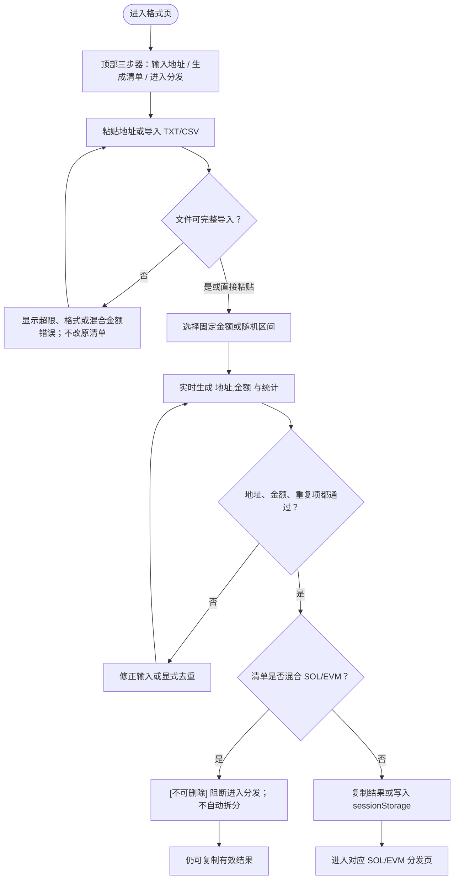

### 优化流程

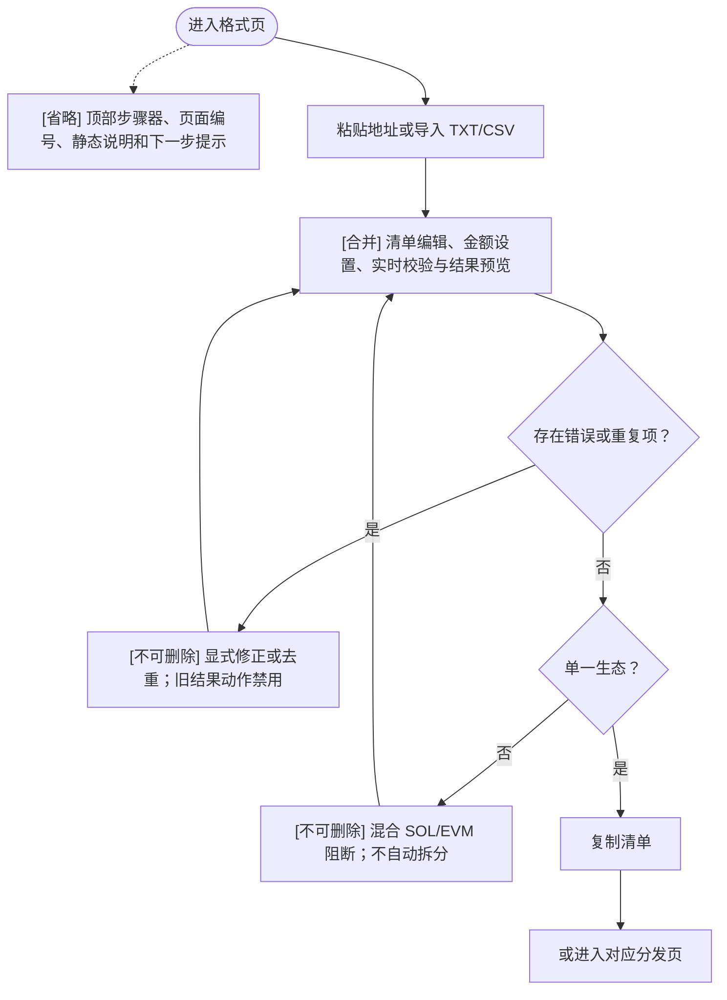

### 保留与变更

- `[合并]` 左侧编辑和右侧预览成为一个清单编辑核心，但地址类型、金额精度、重复项和文件完整性检查全部保留。
- `[省略]` 只删除三步器、说明性文案和重复的结果格式提示。
- `[不可删除]` 混合生态阻断、显式去重、文件错误时“不修改当前清单”、安全随机源和跨页传递兼容性。

## 2. SOL 批量分发 `/sol/`

### 功能清单

- 发现并连接多个注入式 Solana 钱包，显示连接账户和余额。
- 选择 Mainnet、Devnet 或 Testnet，可覆盖 RPC。
- 使用共享清单生成器粘贴/导入地址，设置固定或随机 SOL，显式去重和清空。
- 严格解析 Solana 地址、正金额和最多 9 位小数；按实际 legacy transaction 序列化大小规划最少批次。
- 只读预检读取最新 blockhash、估算所有交易手续费并检查 `总金额 + 手续费` 是否小于等于钱包余额。
- 钱包支持时一次调用 `signAllTransactions`；否则逐批请求签名。提交使用 RPC preflight，并逐笔等待 `confirmed`。
- 展示签名、已提交和已确认进度及 Solscan 链接。
- 只要已有签名被提交，失败状态就锁定当前任务，要求先核对链上记录再新建空白任务。

### 当前流程

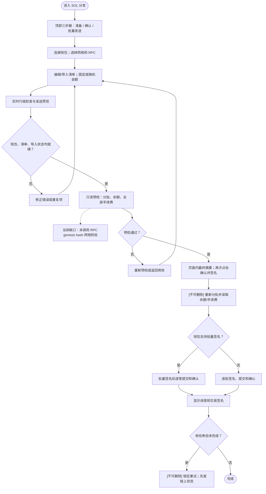

### 优化流程

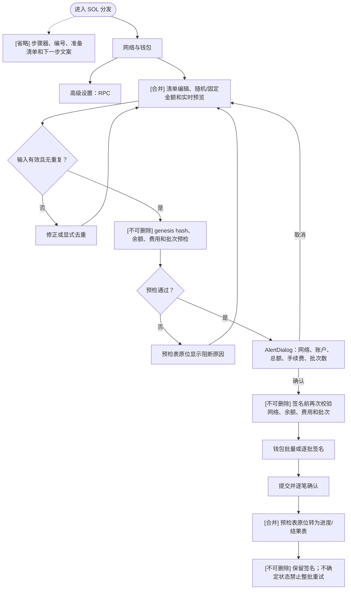

### 保留与变更

- `[不可删除]` 优化后 SOL 分发必须像 SOL 归集一样，在预检和签名前调用 genesis hash 校验；网络不匹配时不得触发钱包签名。
- `[合并]` 编辑与预览、预检表与结果表；发送核心的按大小分批、批量/逐批签名分支保持不变。
- `[省略]` 页面内三阶段展示和重复提示；动态状态、交易数、金额、费用、签名和阻断错误仍可见。

## 3. EVM 批量分发 `/evm/`

### 功能清单

- 连接多个 EVM 注入式钱包，选择内置网络或 CreateX 页显式注册的自定义网络，可覆盖 RPC。
- 发送已确认元数据的原生币，或标准 ERC20 Token；未确认原生币元数据的链只开放 Token。
- Token 模式校验 RPC chain ID、合约代码和 `decimals`，读取名称、符号及钱包 Token 余额。
- 使用共享清单生成器，金额精度随原生币或 Token `decimals` 变化。
- 预检固定 Disperse 地址的 runtime hash；原生币检查余额、Gas 和总扣款；Token 检查余额、allowance、授权次数、Gas 和原生币余额。
- Token allowance 不足时先精确授权本次总额，等待授权回执成功后再提交分发；否则只需一笔分发。
- 原生币调用 `disperseEther`，Token 调用 `disperseToken`；显示授权/分发哈希和浏览器链接。
- 已提交哈希的错误任务锁定直接重试；用户只能核对记录并新建空白任务。

### 当前流程

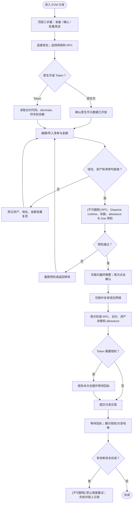

### 优化流程

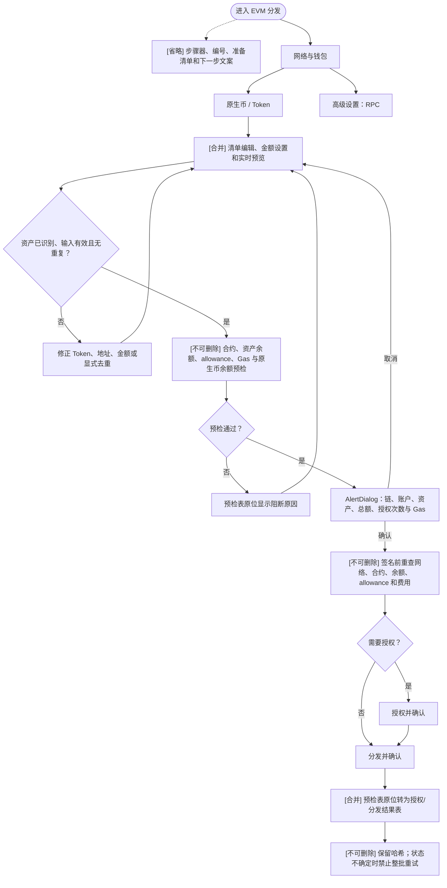

### 保留与变更

- `[不可删除]` RPC chain ID、canonical Disperse runtime、Token 合约、余额、allowance、Gas 与原生币余额检查；Token 授权必须先确认成功。
- 当前执行函数会重查网络、合约、Token 余额和 allowance，但没有完整重复页面预检中的费用预算。优化流程必须在调用既有发送函数前再次调用只读预检，以满足“签名前重查费用”，无需重写链上发送核心。
- `[合并]` 编辑/预览与预检/结果区域；自定义链仍只能来自 CreateX 页的显式注册。

## 4. ERC20 代币归集 `/evm/collect/`

### 功能清单

- 选择 EVM 网络、RPC、非零目标地址和一个或多个 ERC20 合约。
- 导入 `0x私钥` 或 `标签,0x私钥`；按派生地址去重，私钥只在浏览器内存中形成签名账户。
- 单次最多 1,000 个来源、1,000 个资产，并限制来源 × 资产的余额检查总数不超过 5,000。
- 读取 Token 名称、符号、decimals 和每个来源余额；余额为 0 的组合跳过。
- 预检每笔 `transfer`：先 `simulateContract`，再按估算 Gas 增加 20% 缓冲，检查单笔费用上限和每个来源钱包的累计原生币余额。
- 预检通过后清空可见私钥输入；签名账户只保留在内存计划中。
- 执行前逐笔重新模拟、重新估 Gas、检查费用上限和来源原生币余额，然后本地签名、提交并等待回执。
- 某来源出现提交/确认不确定时，停止该来源后续交易；其他来源继续逐项处理。
- 结果逐项显示来源、Token、金额、状态和哈希，可筛选、搜索并导出 CSV。

### 当前流程

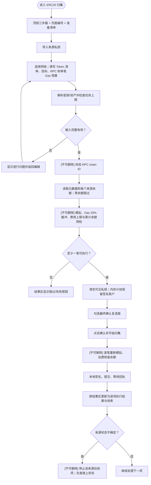

### 优化流程

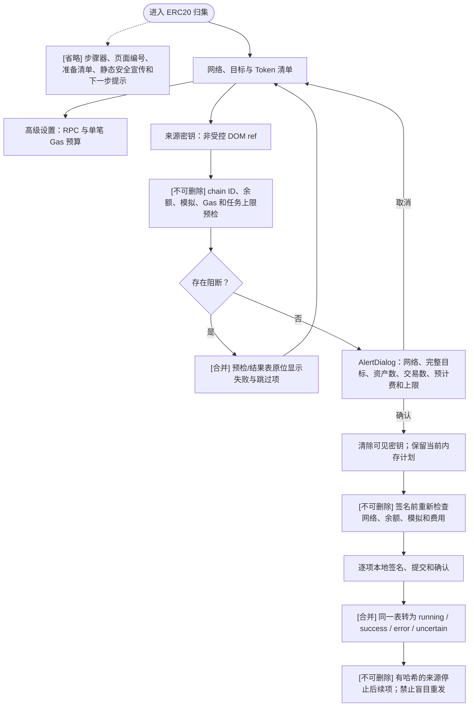

### 保留与变更

- `[合并]` “确认复选框 + 执行按钮”变成一次 `AlertDialog`；确认摘要仍必须包含完整目标地址、交易数、预计费和 Gas 预算上限。
- `[不可删除]` 非受控密钥输入、错误脱敏、工作量硬上限、预检后清空可见密钥、签名前重模拟/重估费、逐来源不确定状态熔断。
- L2 的 L1 数据费当前不包含在单笔 Gas 预算中，确认摘要必须继续明确这一边界。

## 5. EVM NFT 归集 `/evm/nft-collect/`

### 功能清单

- 选择只读来源地址或来源私钥作为资产发现身份；实际执行前始终需要对应 owner 私钥。
- 选择 EVM 网络、ERC721/ERC1155 标准和 NFT 合约；合约检查会识别标准、名称、符号及 ERC721Enumerable 能力。
- 手工输入 Token ID 或闭区间（如 `1,3,8-12`）、本地导入 TXT/CSV，或直接编辑 `合约地址,Token ID` 原始清单。
- NFT 输入默认最多 1,000 个唯一资产；合并时去重，遇到错误或超限不会部分写入。
- ERC721 自动发现顺序：Enumerable → 可用时 Blockscout 候选 + 同一链上快照复核 → Transfer/ERC-2309 事件历史回溯 + `ownerOf` 复核。
- 自动事件回溯优先定位合约部署区块；无法定位时允许用户指定起始区块，并把结果标记为有限范围。
- 完整发现结果仍需用户点击“加入资产清单”；部分结果还必须单独确认“仅归集已验证项目”。
- ERC1155 不猜 Token ID；用户明确给出 ID 后，执行时读取每个来源的完整余额。
- 资产表展示合约、Token ID、数量和有效/重复/错误状态；可单项或批量移除，有错误的原始行不会被静默删除。
- ERC721 以 `ownerOf` 匹配来源；ERC1155 以 `balanceOf` 读取余额。同来源 + 同合约的 ERC1155 最多 100 个 ID 合并为一次标准批量转账，同时保留逐 ID 结果行。
- 后续模拟、费用上限、本地签名、结果与不确定状态处理与 ERC20 归集共享。

### 当前流程

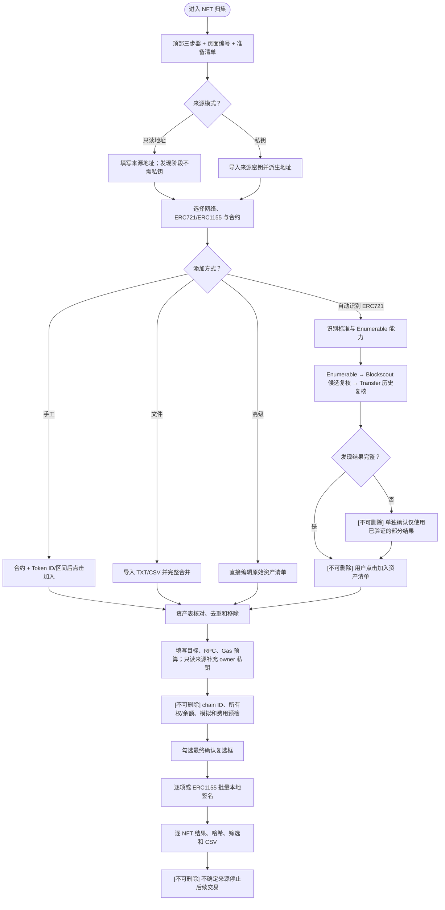

### 优化流程

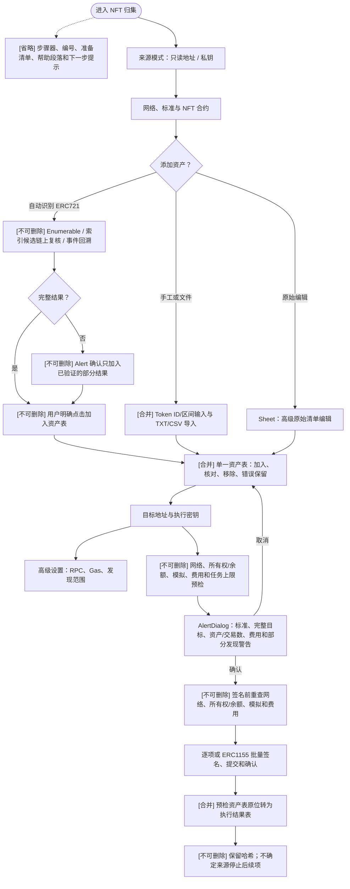

### 保留与变更

- `[合并]` 手工添加和文件导入；所有资产最终只进入一张明确的待归集表。高级原始编辑移动到 `Sheet`。
- `[不可删除]` 完整扫描也必须点击加入；部分扫描必须先单独确认；Blockscout 只提供候选，最终所有权必须由链上快照验证。
- 使用公开 Blockscout 发现会向第三方暴露来源地址与 NFT 合约，这是只读模式的隐私边界；界面应在发起查询前保留明确提示。
- ERC1155 自动识别只切换标准，不自动猜测 Token ID；无对应私钥的 ERC721 必须跳过。

## 6. SOL 归集 `/sol/collect/`

### 功能清单

- 导入 Base58、32/64 字节 JSON 数组密钥，或 `标签,密钥`；按派生地址去重。
- 选择 Mainnet、Devnet 或 Testnet，配置 RPC、目标地址、每钱包保留额和最小归集金额。
- 预检和执行前都按 genesis hash 校验 RPC 网络。
- 预检逐来源读取余额、最新 blockhash 和手续费，计算 `余额 - 手续费 - 保留额`；零余额、余额不足、低于阈值或与目标相同的来源跳过。
- 任一来源发生 RPC 预检错误时不开始整批签名；正常跳过项不阻断其他来源。
- 执行时重新解析密钥并再次校验网络，然后清空可见密钥。
- 每个来源在签名前重新读取余额、手续费和 blockhash，重新计算金额，再本地签名并顺序提交确认。
- 本地交易签名必须与 RPC 返回签名一致；已签名/已提交但未确认时显示签名并提示不要盲目重发。
- 预检逐来源显示余额、费用和可归集金额；执行结果显示最终金额、状态和签名，可筛选、搜索、导出 CSV。

### 当前流程

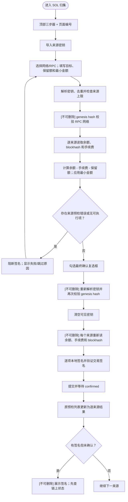

### 优化流程

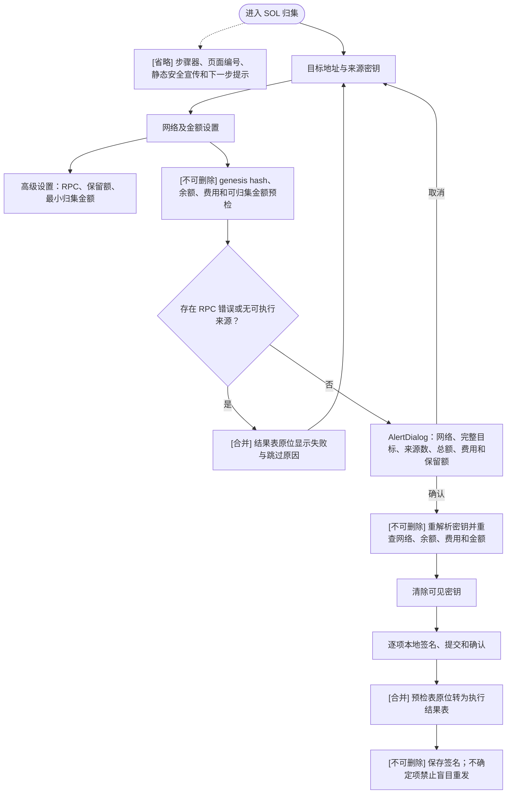

### 保留与变更

- `[合并]` 确认复选框和执行按钮改为一次 `AlertDialog`；预检列表在原位成为结果列表。
- `[不可删除]` 双重 genesis hash 校验、执行时逐项重算金额、可见密钥清理、RPC 签名一致性检查和状态不确定提示。
- 保留额为 0 的配置仍允许，但它是动态警告而不是静态宣传文案；用户必须在确认摘要中看到该值。

## 7. CreateX 合约部署 `/evm/deploy/`

### 功能清单

- 连接 EVM 钱包，输入可信 HTTPS RPC 和可选 HTTPS 区块浏览器地址；从 RPC 读取 Chain ID。
- 已知链使用内置/viem 注册表元数据；元数据冲突时要求选择候选，未知链可手工填写并明确确认原生币名称、符号和 decimals。
- 未确认原生币元数据仍允许部署和 Token 分发，但不开放该链的原生币分发。
- 固定部署参数：canonical CreateX 地址、raw/guarded salt、Disperse initCode、initCode hash、runtime hash、固定目标地址，交易 `value = 0`。
- 部署前校验 8 项：固定产物、RPC/Chain ID、钱包网络、CreateX runtime、CREATE2 地址、目标地址状态、exact-call 模拟、Gas 余额。
- 目标地址已有正确 runtime 时判定为已部署；存在其他字节码时永久阻断，不覆盖部署。
- Gas 估算增加 20% 上限缓冲，并固定 EIP-1559 或 legacy 费用参数；余额必须覆盖费用上限。
- 签名前完整重跑校验，再复核钱包账户和 chain ID；钱包弹窗交互地址固定为 CreateX、`value` 固定为 0。
- 提交后校验成功 receipt、CreateX `ContractCreation` 事件中的目标地址/guarded salt，以及部署后 runtime hash。
- 部署或已部署验证成功后，仅在用户填写链名称并点击“添加到 EVM 分发”时写入本地链配置；从不自动注册。

### 当前流程

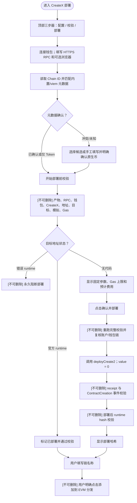

### 优化流程

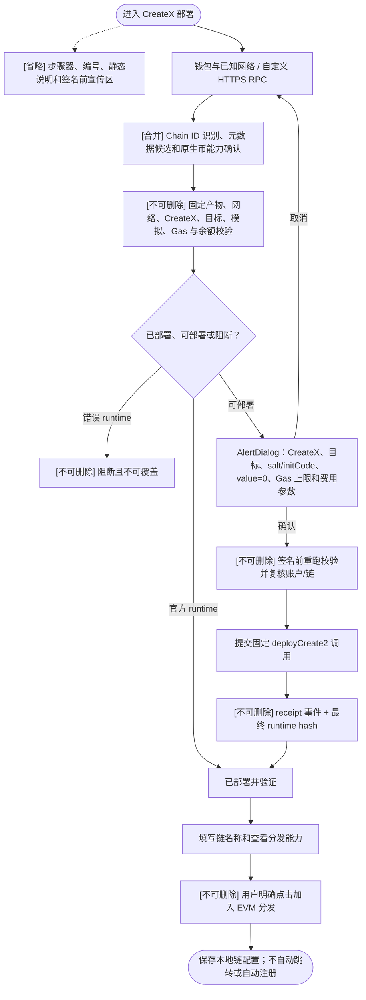

### 保留与变更

- `[合并]` RPC 识别、链元数据和原生币能力集中在同一网络配置区域；十项校验使用一张动态表。
- `[不可删除]` 固定部署产物、canonical CreateX runtime、CREATE2 目标、目标地址占用阻断、20% Gas 缓冲、签名前重检、receipt 事件和最终 runtime hash。
- 部署哈希出现后，即使 receipt 或 runtime 验证失败，也必须作为状态不确定结果保留，不能重新启用无提示部署。
- 链注册继续由用户显式触发；“部署成功”与“加入 EVM 分发”是两个不同动作。

## 首页与统一页面结构

### 首页目标

- 只保留 ChainKit 标题、四个工具分类、七张工具卡和 `全部 / EVM / Solana` 筛选。
- 删除工作流示意、“签名前预检”说明区、静态安全宣传和少量网络营销列表。
- `ToolDefinition` 首页筛选元数据改为 `evm | solana`；实际网络以各工具页的网络配置为准。

### 工具页目标

- `ToolPageLayout` 只接收标题、动态状态、上下文操作和内容；移除 `steps`、`activeStep`、`stepStates`、`description`、`eyebrow`、信任标签等展示参数。
- 桌面使用双栏工作台，移动端单栏；主操作在合理范围内保持可见。
- 表格放入响应式 `ScrollArea`，不得让 375 px 页面出现整页横向滚动。
- 可见文案只保留标题、字段、选项、按钮、金额/费用/次数、动态校验、阻断错误、执行状态、确认摘要、哈希和不确定状态警告。
- `aria-label`、`sr-only`、焦点提示、错误关联和 live region 等非可见无障碍信息继续保留。

## 不可跨越的安全与兼容边界

1. URL、页面入口、链上函数签名、固定合约地址、CreateX 部署产物和结果 CSV 列保持兼容。
2. 不改写分发、归集、NFT 发现和 CreateX 的链上执行核心；页面只重排信息并在签名前复用现有只读预检。
3. 所有输入变化必须使旧预检失效；确认对话框只确认当前输入快照。
4. 签名前必须复核所选网络/RPC，及该流程适用的账户、余额、费用、allowance、所有权或 runtime。
5. 任何已产生哈希/签名的异常都进入 `uncertain` 或等价锁定状态；不得提供“一键整批重试”。
6. 私钥不得进入 React state、浏览器持久化、Analytics、日志、URL、CSV 或错误文本；敏感页继续零 Analytics。
7. NFT 自动发现不得把索引器结果直接视为所有权；完整与部分发现都必须由用户明确加入，部分发现多一次确认。
8. 混合 SOL/EVM 清单不自动拆分；CreateX 成功后不自动注册链。
9. 原生币元数据未确认时只开放 Token；RPC、钱包链、canonical 合约字节码或部署 runtime 不匹配时阻断签名。
10. 清空任务改用 shadcn `AlertDialog`；它只清除当前任务，不能在未解释哈希状态时抹掉已提交记录。

## 验收覆盖

- 七个工具分别覆盖：编辑、导入、输入变化使预检失效、预检失败、取消 `AlertDialog`、执行成功、部分失败、状态不确定、清空任务和重新开始。
- 组件交互覆盖 `Combobox`、`Tabs`、`Dialog`、`AlertDialog`、`Sheet`、`Collapsible`、键盘导航、焦点陷阱/恢复及禁用状态。
- 安全回归覆盖：私钥 DOM/计划清理、敏感页无 Analytics、CSV 无密钥、错误脱敏、哈希锁定、SOL genesis hash、EVM chain ID/runtime、NFT 部分结果确认。
- 首页和七个工具页在 375、768、1024、1440 px 检查无整页横向溢出、无控制台错误、键盘可操作且可见文案符合本文件规则。
- 最终保持现有测试基线通过，并运行 `npm test` 与 `npm run build`；预先存在的 `design-system/` 和 `output/` 不属于本次修改范围。
